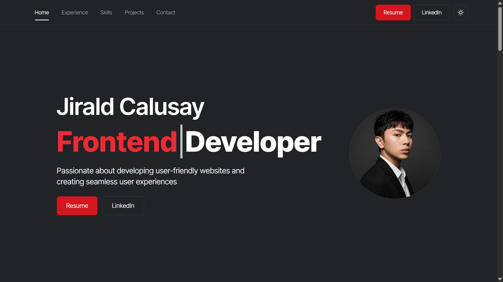

# Portfolio Website

A modern and responsive personal portfolio built with Next.js to showcase my projects, skills, and contact information.

🔗 Live Demo: https://jiraldcalusay.vercel.app

## 📸 Preview

## ✨ Features

-   Responsive design
-   Contact form with EmailJS
-   SEO-friendly pages
-   Dark mode
-   Fast performance using Next.js

## 🛠 Tech Stack

-   React
-   Next.js
-   Nodejs
-   TypeScript
-   Tailwind CSS
-   EmailJS
-   Motion

## 👤 Author

Jirald Calusay

-   GitHub: https://github.com/yourusername
-   LinkedIn: https://linkedin.com/in/yourname
-   Email: your@email.com
